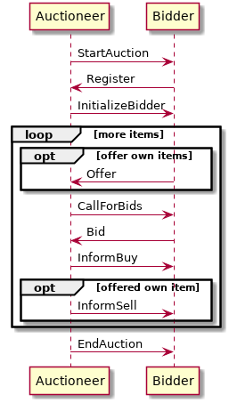

README
======

About this Package
------------------

Use this project as a starting point for implementing your bidder agent. This project contains:

- a valid pom.xml file including the JIAC dependency and repository; feel free to change the project's name if you like, or add additional libraries you might need
- a sequence diagram showing the expected message exchange between auctioneer and bidder
- the complete auctioneed agent, including AgentBean and configuration; you can use those as reference for what the auctioneer does, and how certain things can be done in JIAC
- a very small stub for the bidder agent; basically just an empty file with some pointers where to start
- starter classes for both, auctioneer and bidder
- classes describing the different messages being exchanged between auctioneer and bidder

You should not modify any of those classes (except for the bidder agent stub, of course), otherwise your agent will most likely not work correctly in the final competition

The Auction Protocol
--------------------

The auction protocol is shown below.

### Starting the Auction

- all bidder agents should start before the auctioneer; they can start any time before, or even keep running for multiple auctions
- as soon as the auctioneer starts, it sends a **StartAuction** message to the specified message group
- upon receiving the StartAuction, the bidder knows the aucitoneer's message box address and can reply with a **Register** message, including it's own ID (the ID should include your group number)
- the auctioneer sends the **InitializeBidder** message including the initial wallet to the bidder

### Bidding and Offering

- at any time after the start of the auction, bidders can send **Offer** messages, offering one of their own resources for sale
- if there are more items to be sold (by the auctioneer itself, or from other bidders), the auctioneer sends a **CallForBids** to all bidders, including the type of resource, the reservation price, etc.
- if the bidder is interested in the item, it can respond with a **Bid**
- after a fixed time, the auctioneer evaluates the bids and sends out **InformBuy** messages to each individual bidder, including whether the item was bought or not (but not by whom else) and at which price
- if the item was offered by another bidder, the auctioneer will also send an **InformSell** message to the seller

### End of Auction

- finally, the auctioneer will send an **EndAuction** message to each bidder, announcing the winner of the auction as a whole as well as their final Wallet

General Tipps and Advice
----------------------------------

* the auctioneer switches between different phases, e.g. for bidding, for evaluation, etc.; each of those phases lasts a certain amount of time; after that time is up, no more bids will be accepted until the next bidding phase
* different properties of the auctioneer can be set in the Spring configuration file, e.g. the number of items to sell, or the minimum offer for each item; you can change those parameter and see how your bidder reacts
* you can try to implement different bidder agents, following different strategies, and let them bid against each other
* if you do so, try to think of a way to separate the implementation of the auction protocol from the bidding logic, so that parts of the BidderBean can be reused

Final Competition
-----------------

At the very end of the course, there will be a competition where you can pit your bidder agent agains the other groups' agents. For this, we will set up an auctioneer agent on one of our servers, to which you will have to connect. Detailled instructions will follow.

